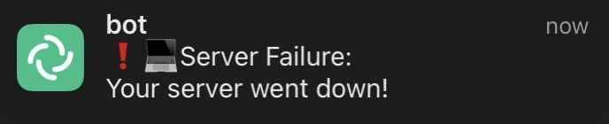
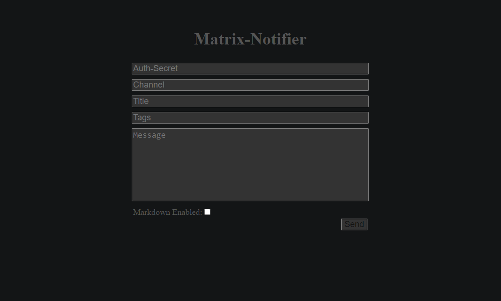
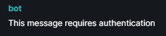
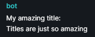
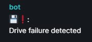
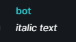

# Matrix-Notifier
Simple REST-API for sending messages over the [Matrix](https://matrix.org) protocol, built with [matrix-nio](https://github.com/poljar/matrix-nio).

## Features

- Docker support
- Authentication support
- Sending encrypted messages
- UTF-8 support
- Markdown support for messages
- Tag support to embed emojis in the title by using their short codes
- Title support
- Web UI to send messages
- Webhooks

## Setup

The easiest way of installing would be to use docker, however if for any reason that is not an option you can also install it from source.

Before starting, you may want to create a bot account on the homeserver of your liking.

If you're ever having trouble with the database just use the example-database.db provided under examples/example-database.

### Requirements

If you're using the docker-compose.yml you will need to have docker and docker-compose as well as curl installed, and when using the dev-docker-compose.yml you will also need git.

Building from source is not recommended however if you decide to do so anyway you can install the requirements by using the requirements.txt provided in the server and bot directory.
To do so just move to the directory and use this command:
```
pip3 install -r requirements.txt
```

### Install with Docker

There are two docker-compose.yml files provided, the docker-compose.yml and the dev-docker-compose.yml. The docker-compose.yml is what's recommended and also the most stable, using the image from dockerhub and the other one building from the git repository.

If you're using the default docker-compose follow the instructions below:
```
# Create a directory for your docker-compose and move into it
mkdir ./matrix-notifier && cd ./matrix-notifier

# Clone the docker-compose.yml and example.env
curl -O https://raw.githubusercontent.com/NLion74/Matrix-Notifier/main/docker/docker-compose.yml
curl -O https://raw.githubusercontent.com/NLion74/Matrix-Notifier/main/docker/example.env

# Copy the example.env to .env
cp example.env .env

# Customize the .env file and when you're done start the docker-compose
docker-compose up -d
```

If you're using the dev docker-compose follow these instructions below:
```
# Clone the repository
git clone https://github.com/NLion74/Matrix-Notifier

# Move into the repository's docker folder
cd ./Matrix-Notifier/docker

# Copy the example.env to .env
cp example.env .env

# Customize the .env file and when you're done start the docker-compose
docker-compose up -d
```

Now everything should be up and running, and you can now move to the [Usage Section](#Usage).

### Install from source

Building from source is not recommended but if you decide to do so anyway here's a guide.

```
# Clone the repository
git clone https://github.com/NLion74/Matrix-Notifier

# Move into the repository's server folder
cd ./Matrix-Notifier/server

# Edit the config.py and start the server
python3 app.py

# Move into the repository's bot folder
cd ../bot

# Edit the config.py and start the bot
python3 main.py
```

Now if all the dependencies are installed the server and bot should be up and running. You can now move on to the [Usage Section](https://github.com/NLion74/Matrix-Notifier/#Usage).

## Usage

### Sending messages

Messages can either be sent via HTTP POST request and by using the Web UI or via HTTP GET request by using Webhooks

#### POST

Here's an example showing how you can send messages via POST request:

```
curl \
  -H "Channel: !liLFnvuVbMtrtbOYMS:matrix.org" \
  -H "Title: Server Failure"
  -H "Tags: exclamation, computer"
  -d "Your server went down!" \
  127.0.0.1:5505
```

And on ios with element installed that would result in a notifcation like this:



#### Web UI

Alternatively you could use the Web UI to send messages, which looks like this:



After you've seen how to send messages via POST this should be rather self-explanatory.

#### Webhooks

An alternative to using POST would be to send messages via HTTP GET request. This can be done by using webhooks.

To use webhooks, simply make a request to the ```/webhook``` route and use queries to provide options just like you would normally.

```
curl "127.0.0.1:5505/webhook?channel=!liLFnvuVbMtrtbOYMS:matrix.org&title=Server+Failure&tags=exclamation,computer&message=Your+server+went+down!"
```

Which would result in a notification like this.


### Options

In this section we will be going through every single option, explain what they do and how to use them. At the end of the section you'll find a summary of all options.

#### Channel

This option is always required, and is used for the bot to identify the rooms. The value has to be the room id of the room you want your messages getting sent to.

To obtain the room id of a room on element right-click the room, then click on Settings. The room id can then be found in advanced section under Internal room ID.

#### Authorization

This option is required for authentication if enabled.

```
curl -H "Channel: !liLFnvuVbMtrtbOYMS:matrix.org" -H "Authorization: super_secure_secret" -d "This message requires authentication"
```



#### Message title

The title will be a line on top of the message with a ":" at the end of the title.
Setting a title is optional.

```
curl -H "Channel: !liLFnvuVbMtrtbOYMS:matrix.org" -H "X-Title: My amazing title" -d "Titles are just so amazing" 127.0.0.1:5505
curl -H "Channel: !liLFnvuVbMtrtbOYMS:matrix.org" -H "Title: My amazing title" -d "Titles are just so amazing" 127.0.0.1:5505
curl -H "Channel: !liLFnvuVbMtrtbOYMS:matrix.org" -H "t: My amazing title" -d "Titles are just so amazing" 127.0.0.1:5505
```



#### Message tags

The tags will be a line on top of the message with a ":" at the end of the tags. To send multiple tags just split them with "," between them. With this you could tag specific server to identify them.
Setting tags is optional.

A list of emojis can be found here: https://www.webfx.com/tools/emoji-cheat-sheet/

```
curl -H "Channel: !liLFnvuVbMtrtbOYMS:matrix.org" -H "X-Tags: computer_disk, exclamation" -d "Drive failure detected" 127.0.0.1:5505
curl -H "Channel: !liLFnvuVbMtrtbOYMS:matrix.org" -H "Tags: computer_disk, exclamation" -d "Drive failure detected" 127.0.0.1:5505
curl -H "Channel: !liLFnvuVbMtrtbOYMS:matrix.org" -H "ta: computer_disk, exclamation" -d "Drive failure detected" 127.0.0.1:5505
```



#### Markdown messages

This option enables the use of markdown. Setting markdown is optional. Default is set to false.
Markdown can only be used in the message body not for the headers.

A guide on how to use markdown can be found here: https://www.markdownguide.org/basic-syntax/.

```
curl -H "Channel: !liLFnvuVbMtrtbOYMS:matrix.org" -H "X-Markdown: true" -d "_italic text_" 127.0.0.1:5505
curl -H "Channel: !liLFnvuVbMtrtbOYMS:matrix.org" -H "Markdown: true" -d "_italic text_" 127.0.0.1:5505
curl -H "Channel: !liLFnvuVbMtrtbOYMS:matrix.org" -H "m: true" -d "_italic text_" 127.0.0.1:5505
```



#### List of all options

```
# Required for sending messages. Used to tell the server which room ids to send messages to. Can be used repeatedly.
X-Channel(Case Sensitive) - Channel(Case Insensitive), c(Case Insensitive)

# Used for api authentication. Cannot be used repeatedly.
X-Authorization(Case Sensitive) - Authorization(Case Insensitive), auth(Case Insensitive)

# Sets the title of the message. Cannot be used repeatedly.
X-Title(Case Sensitive) - Title(Case Insensitive), t(Case Insensitive)

# Used to put emojis into the title without actually typing them out.
# Useful if wherever you want to send emojis from doesnt support utf-8.
# Emoji codes can be found here: https://www.webfx.com/tools/emoji-cheat-sheet/
X-Tags(Case Sensitive) - Tags(Case Insensitive), Tag(Case Insensitive), ta(Case Insensitive)

# Used to enable and disable markdown. Default is set to false. Cannot be used repeatedly
X-Markdown(Case Sensitive) - Markdown(Case Insensitive), m(Case Insensitive)
```

If you need more examples take a look into the examples directory.

### Getting messages from the server

#### GET

If you want to get the messages from the server you can do that via HTTP GET request.

```
curl \
  127.0.0.1:5505/messages
```

This will return all messages in json format.
Don't forget to add the authorization header if authorization is enabled.

### Disclaimer

Note that if your room id contains a "," the server will break. I don't know if room ids with "," in them exist but if they do this will be an issue that you should be aware of.

Also, when using webhooks make sure your auth_secret doesn't contain any "&" because that's used to split the queries.

## Contact
If there are any questions regarding this project, feel free to contact me over any platform listed on https://nlion.nl/.