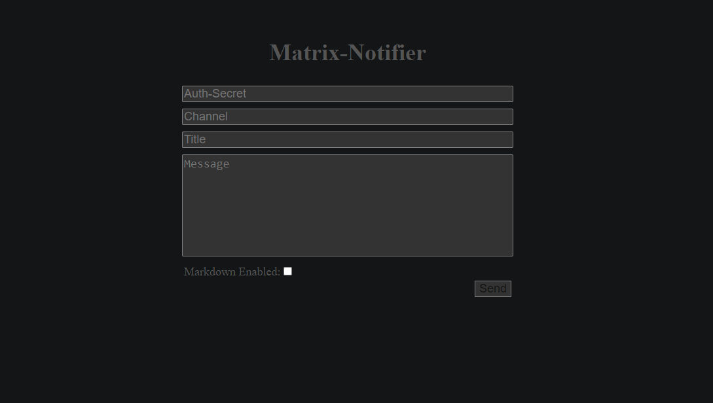

# Matrix-Notifier
A Matrix Bot inspired by gotify and ntfy though it has way less features.

## Setup

The easiest way of installing would be to use docker, however if for any reason that is not an option you can also install it from source.

Before starting, you may want to create a bot account on the homeserver of your liking.

If you're ever having trouble with the database just use the example-database.db provided under examples/example-database.

### Requirements

If you're using the docker-compose.yml you will need to have docker and docker-compose as well as curl installed, and when using the dev-docker-compose.yml you will also need git.

Building from source is not recommended however if you decide to do so anyway you can install the requirements by using the requirements.txt provided in the server and bot directory.
To do so just move to the directory and use this command:
```
pip3 install -r requirements.txt
```

### Install with Docker

There are two docker-compose.yml files provided, the docker-compose.yml and the dev-docker-compose.yml. The docker-compose.yml is what's recommended and also the most stable, using the image from dockerhub and the other one building from the git repository.

If you're using the default docker-compose follow the instructions below:
```
# Create a directory for your docker-compose and move into it
mkdir ./matrix-notifier && cd ./matrix-notifier

# Clone the docker-compose.yml and example.env
curl -O https://raw.githubusercontent.com/NLion74/Matrix-Notifier/main/docker/docker-compose.yml
curl -O https://raw.githubusercontent.com/NLion74/Matrix-Notifier/main/docker/example.env

# Copy the example.env to .env
cp example.env .env

# Customize the .env file and when you're done start the docker-compose
docker-compose up -d
```

If you're using the dev docker-compose follow these instructions below:
```
# Clone the repository
git clone https://github.com/NLion74/Matrix-Notifier

# Move into the repository's docker folder
cd ./Matrix-Notifier/docker

# Copy the example.env to .env
cp example.env .env

# Customize the .env file and when you're done start the docker-compose
docker-compose up -d
```

Now everything should be up and running, and you can now move to the [Usage Section](https://github.com/NLion74/Matrix-Notifier/#Usage).

### Install from source

Building from source is not recommended but if you decide to do so anyway here's a guide.

```
# Clone the repository
git clone https://github.com/NLion74/Matrix-Notifier

# Move into the repository's server folder
cd ./Matrix-Notifier/server

# Edit the config.py and start the server
python3 app.py

# Move into the repository's bot folder
cd ../bot

# Edit the config.py and start the bot
python3 main.py
```

Now if all the dependencies are installed the server and bot should be up and running. You can now move on to the [Usage Section](https://github.com/NLion74/Matrix-Notifier/#Usage).

## Usage

The Syntax is inspired by ntfy as you may notice if you've ever used ntfy before.

The format for sending messages looks like this:

```
curl \
  -H "Channel: [Room_Id]" \
  -d "[Message_Body]" \
  [host]:[port]
```

Another example with some actual values:

```
curl \
  -H "Channel: !liLFnvuVbMtrtbOYMS:matrix.org" \
  -H "Title: Server Failure"
  -H "Tags: exclamation, computer"
  -d "Your server went down!" \
  127.0.0.1:5505
```

And on ios with element installed that would result in a notifcation like this:


Here's a list of headers together with their provided aliases and a description of what these headers are used for:

```
# Required for sending messages. Used to tell the server which room ids to send messages to. Can be used repeatedly.
X-Channel(Case Sensitive) - Channel(Case Insensitive), c(Case Insensitive)

# Sets the title of the message. Cannot be used repeatedly.
X-Title(Case Sensitive) - Title(Case Insensitive), t(Case Insensitive)

# Used to put emojis into the title without actually typing them out.
# Useful if wherever you want to send emojis from doesnt support utf-8.
# Emoji codes can be found here: https://www.webfx.com/tools/emoji-cheat-sheet/
X-Tags(Case Sensitive) - Tags(Case Insensitive), Tag(Case Insensitive), ta(Case Insensitive)

# Used for api authentication. Cannot be used repeatedly.
X-Authorization(Case Sensitive) - Authorization(Case Insensitive), auth(Case Insensitive)

# Used to enable and disable markdown. Default is set to false. Cannot be used repeatedly
X-Markdown(Case Sensitive) - Markdown(Case Insensitive), m(Case Insensitive)
```

Alternatively if you could use the Web UI to send messages, which looks like this:



For more examples take a look into the examples directory.

If you want to see the messages that are stored on the server you can do that like this:

```
curl \
  127.0.0.1:5505/messages
```

If authorization is enabled you'll also have to add an authorization header as well of course.


### Disclaimer

Note that if you're room id contains a "," the server will break. I don't know if room ids with "," in them exist but if they do this will be an issue that you should be aware of.

## Contact
If there are any questions regarding this project, feel free to contact me over any platform listed on https://nlion.nl/.
